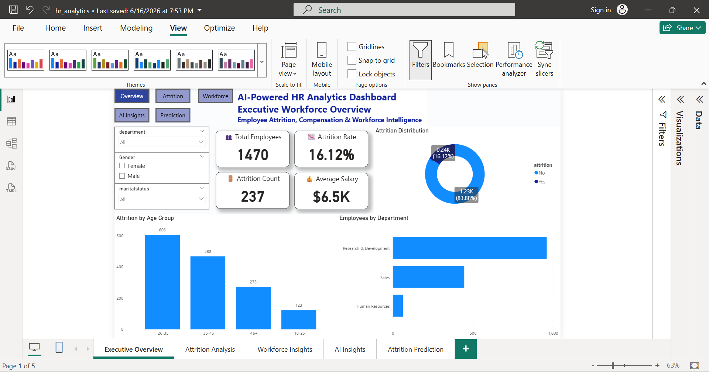
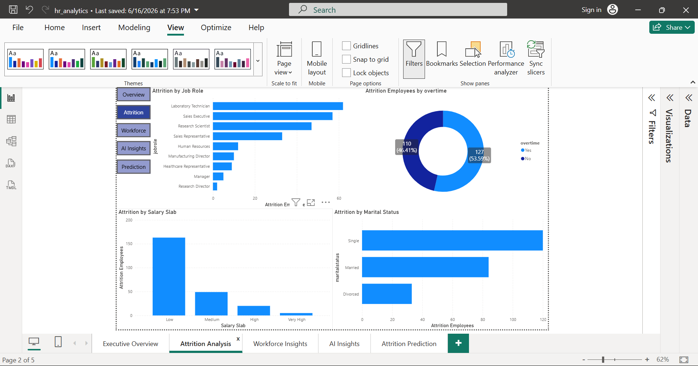
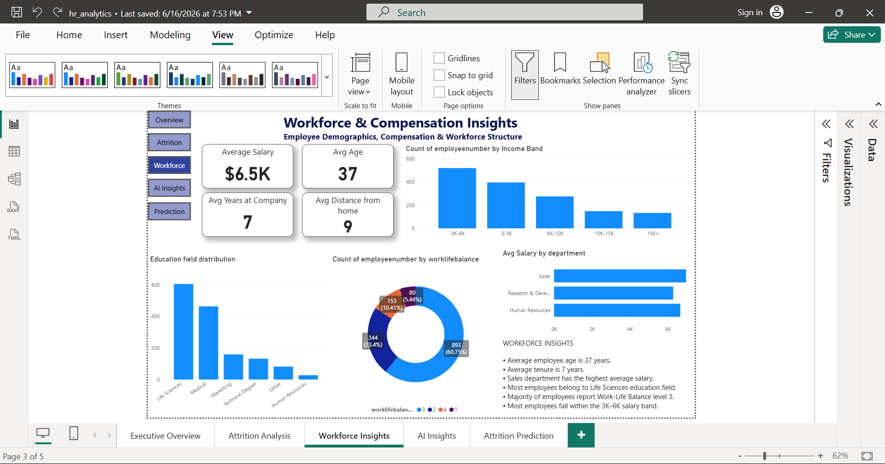
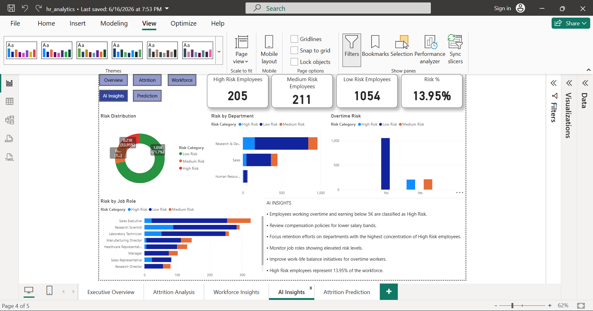
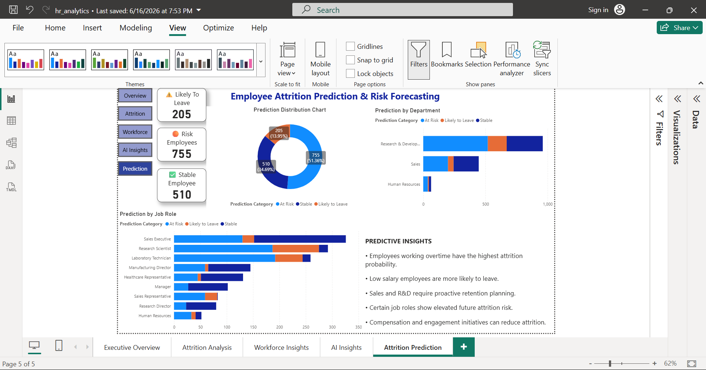

# AI-Powered HR Analytics Dashboard
### Employee Attrition Analysis, Workforce Insights & AI-Based Risk Prediction

---

## Project Overview

This is an end-to-end **AI-Powered HR Analytics Dashboard** built using **PostgreSQL, SQL, Power BI, and DAX**.

The project transforms raw HR employee data into actionable business insights for HR teams and management.

This dashboard helps analyze:

- Employee Attrition
- Workforce Demographics
- Salary Distribution
- Department-wise Risk Analysis
- AI-Based Employee Risk Scoring
- Attrition Prediction & Forecasting

---

## Tech Stack

- PostgreSQL
- SQL
- Power BI
- DAX
- Data Analytics
- Business Intelligence
- AI-based Prediction Logic

---

## Dataset Information

Dataset Used: **IBM HR Analytics Employee Attrition Dataset**

Total Employees: **1470**

Important Features:
- Age
- Department
- Job Role
- Monthly Income
- Attrition
- Overtime
- Job Satisfaction
- Work-Life Balance
- Years at Company

---

# Dashboard Pages

## 1) Overview Dashboard
Contains:
- Total Employees
- Attrition Count
- Attrition Rate
- Average Salary
- Age Group Analysis
- Department Distribution

---

## 2) Attrition Analysis
Analyzed attrition based on:
- Job Role
- Overtime
- Salary Slab
- Marital Status

---

## 3) Workforce Insights
Analyzed:
- Average Age
- Average Salary
- Salary Distribution
- Education Field Distribution
- Department Compensation
- Work-Life Balance

---

## 4) AI Insights
AI logic classifies employees into:

- High Risk
- Medium Risk
- Low Risk

Risk factors:
- Low Salary
- Overtime
- Low Job Satisfaction
- Poor Work-Life Balance

---

## 5) Attrition Prediction
Prediction Categories:
- Likely to Leave
- At Risk
- Stable

Used rule-based predictive logic to forecast future attrition risk.

---

# Dashboard Screenshots

## Overview Dashboard


---

## Attrition Analysis


---

## Workforce Insights


---

## AI Insights


---

## Attrition Prediction


---

# Key Business Insights

- Overall Attrition Rate = **16.12%**
- Employees doing overtime show higher attrition probability
- Lower salary employees are more likely to leave
- Sales and R&D require retention planning
- Work-life balance significantly affects employee retention

---

# Project Folder Structure

```bash
AI-HR-Analytics-Dashboard/
│
├── Dataset/
├── PowerBI/
├── SQL Queries/
├── Dashboard_Screenshots/
└── README.md
```

---

# Author

## Sarvesh Gudadhe
B.Tech Computer Science Graduate  
Aspiring Data Analyst | BI Analyst | Data Engineer  

### Contact Details
Email: sarvesh02official@gmail.com  
GitHub: https://github.com/sarvesh-analytics  

---

⭐ If you liked this project, feel free to star this repository.
